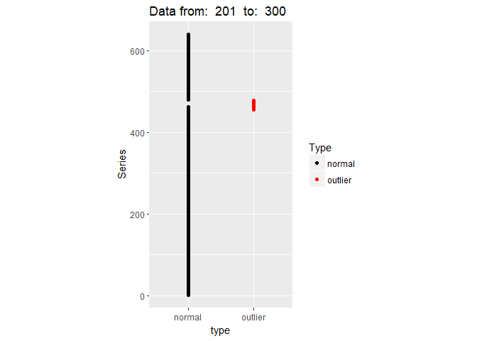
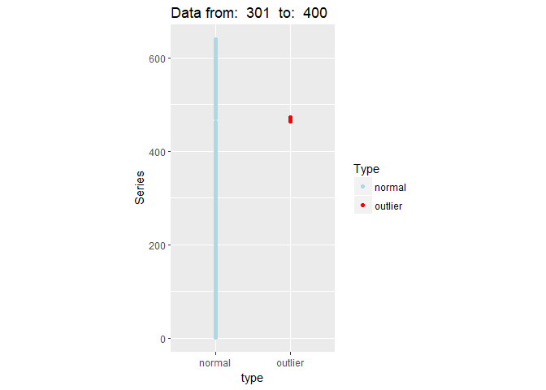
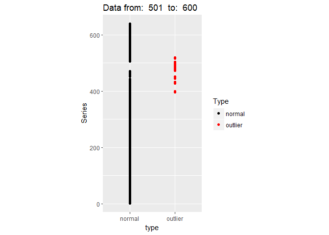
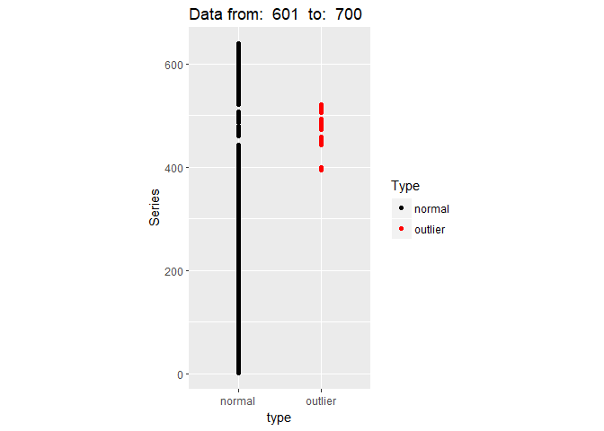
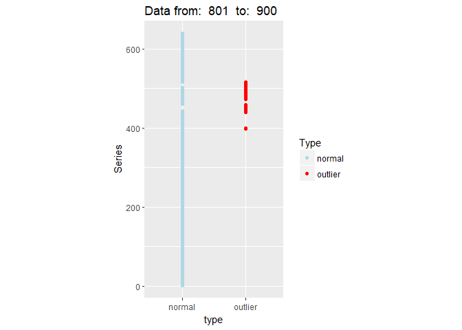
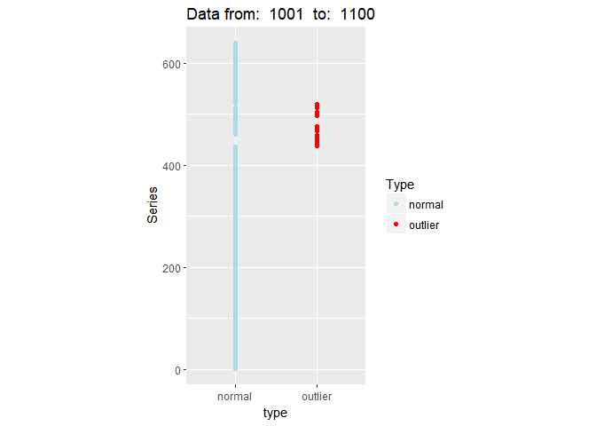
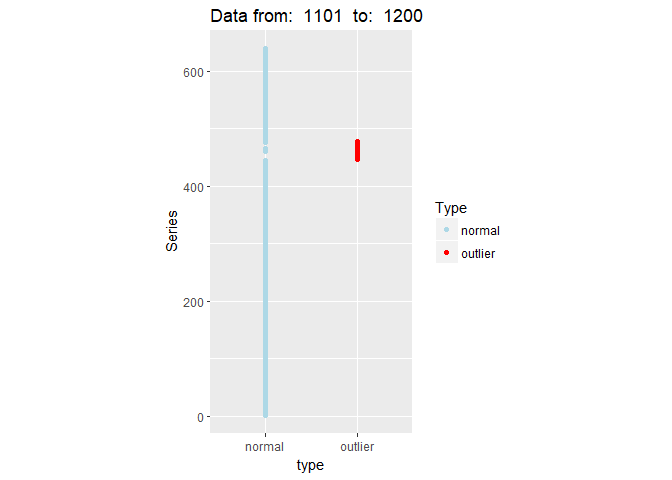
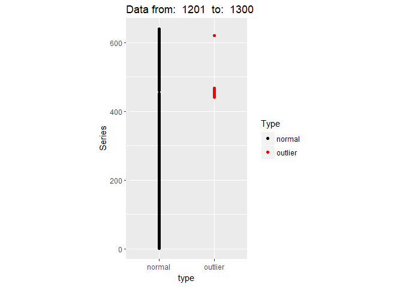

[](http://www.repostatus.org/#wip) [](https://www.gnu.org/licenses/old-licenses/gpl-2.0.html) [](https://travis-ci.org/pridiltal/oddstream)

------------------------------------------------------------------------

[](https://cran.r-project.org/) [](https://cran.r-project.org/package=oddstream) [](commits/master)

------------------------------------------------------------------------

[](/commits/master)

<!-- README.md is generated from README.Rmd. Please edit that file -->
oddstream
=========

The goal of oddstream (Outlier Detection in Data Streams) is to propose a framework that provides real time support for early detection of anomalous series within a large collection of streaming time series data. By definition, anomalies are rare in comparison to a system's typical behaviour. We define an anomaly as an observation that is very unlikely given the forecast distribution. The algorithm first forecasts a boundary for the system's typical behaviour using a representative sample of the typical behaviour of the system. An approach based on extreme value theory is used for this boundary prediction process. Then a sliding window is used to test for anomalous series within the newly arrived collection of series. Feature based representation of time series is used as the input to the model. To cope with concept drift, the forecast boundary for the system's typical behaviour is updated periodically.

Installation
------------

You can install oddstream from github with:

``` r
# install.packages("devtools")
devtools::install_github("pridiltal/oddstream")
```

Example
-------

``` r
library(oddstream)
# Considers the first window  of the data set as the training set and the remaining as the test stream
train_data <- anomalous_stream[1:100,]
test_stream <-anomalous_stream[101:1456,]
find_odd_streams(train_data, test_stream , plot_type = "out_location_plot", trials = 100)
```


    #> Outliers from:  101  to:  200 :  448 449 450 451 452 453 454 455 456 457 458 462 463 464 465 466 467 468 469 470 471 472 473



    #> Outliers from:  201  to:  300 :  455 456 457 458 464 465 466 467 468 469 470 471 472 473 474 475 476 477 478



    #> Outliers from:  301  to:  400 :  464 465 466 467 468 469 470 472


    #> Outliers from:  401  to:  500 :  445 446 447 448 449 450 451 452 453 454 455 456 457 458 461 462 463 464 465 466 467 468 469 470 471 472 473 474 475 476 477 478 479 480 481 482 483 484 485 486 488 489 490 491 492 493 494 495 496 497 498 499 500 501 502 504 505



    #> Outliers from:  501  to:  600 :  396 397 398 399 428 429 432 445 446 447 448 449 450 451 472 473 474 475 476 477 478 479 480 481 482 483 484 485 486 487 488 489 490 491 492 493 494 495 496 497 498 499 500 501 502 503 504 517 518 519 520



    #> Outliers from:  601  to:  700 :  395 396 397 398 399 444 445 446 447 448 449 450 451 452 453 454 455 456 457 458 459 473 476 477 478 481 482 483 484 485 486 489 494 506 507 509 510 511 512 513 514 515 516 517 518 519 520 521


    #> Outliers from:  701  to:  800 :  399 425 428 429 439 443 444 445 446 447 448 449 450 451 452 453 454 455 456 473 474 475 476 477 478 479 480 481 482 483 484 485 486 487 488 489 490 491 492 493 494 495 496 497 498 499 501 502 503 504 505 506 507 508 510 513 514 515 516 517 518 519 520 521



    #> Outliers from:  801  to:  900 :  398 399 439 440 441 445 446 447 448 449 450 451 452 453 454 455 456 457 458 459 473 477 480 482 483 484 488 489 490 492 493 494 495 496 497 499 503 504 505 506 507 508 509 510 511 512 513 514 515 516


    #> Outliers from:  901  to:  1000 :  363 364 365 366 399 423 424 425 447 448 477 479 480 487 488 489 490 492 493 494 495 496 497 498 502 503 504 505 506 507 508 509 510 511 512 513 514 515 516 517 518 519 520 521



    #> Outliers from:  1001  to:  1100 :  438 439 440 441 442 443 444 445 446 447 448 449 450 451 452 453 454 455 456 457 458 459 467 468 469 471 472 473 474 475 476 477 497 499 503 504 513 514 515 516 517 518 519 520



    #> Outliers from:  1101  to:  1200 :  446 447 448 449 450 451 452 453 454 455 456 457 458 459 460 464 466 467 468 469 470 471 472 473 474 475 478



    #> Outliers from:  1201  to:  1300 :  442 444 446 447 448 452 453 454 455 456 457 458 459 460 464 466 467 621
